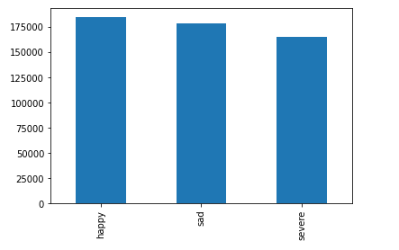
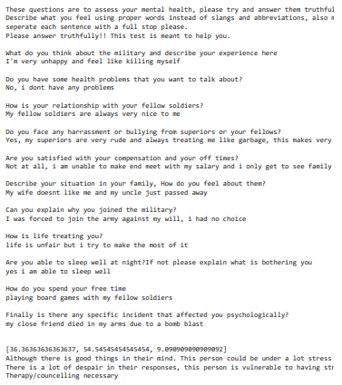

# Mental-Health-Assessment

## Introduction
According to recent studies, PTSD is the most common mental health problem faced by returning troops. The symptoms include difficulty concentrating, lack of interest/apathy, feelings of detachment, loss of appetite, hypervigilance, exaggerated startle response, and sleep disturbances. 
This project provides a method for the military to assess the mental health of soldiers and take responsible actions for them if they in a dark place.

## Dataset
The dataset used in this project is obtained by combining 3 seperate datasets.

**1.** <a href="https://huggingface.co/datasets/emotion">emotions</a> dataset from hugging face. 
**2.** text_emotion dataset from kaggle. 
**3.** <a href="https://www.kaggle.com/nikhileswarkomati/suicide-watch">Suicide_Detection</a> dataset from kaggle. 

**Note: The final dataset is not uploaded here, but it can be generated by downloading each dataset from the given links and running the scripts**

The final dataset contains about 16 emotions which are condensed into 3 for better performance.  
&nbsp;&nbsp;&nbsp;

## Model
Linear SVM is used in this project for emotion detection as it gave the highest accuracy( 92.7% )

### How is the mental health report generated?
The person is asked a series of questions and their responses are tokenized into sentences. 
The sentences are passed into the model to identify the emotions in each and a percentage composition is calculated for each emotion. 
The generate_report function creates a report according to the percentage values.  
Here is a sample response and the report generated.  

