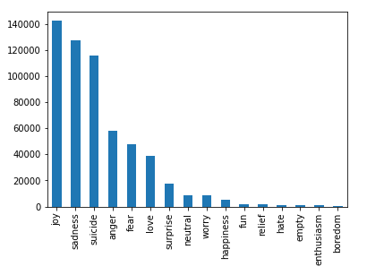

# Mental-Health-Assessment

## Dataset
The dataset used in this project is obtained by combining 3 seperate datasets.

**1.** <a href="https://huggingface.co/datasets/emotion">emotions</a> dataset from hugging face. 
**2.** text_emotion dataset from kaggle. 
**3.** <a href="https://www.kaggle.com/nikhileswarkomati/suicide-watch">Suicide_Detection</a> dataset from kaggle. 

**Note: The final dataset is not uploaded here, but it can be generated by downloading each dataset from the given links and running the scripts**

The final dataset contains about 16 emotions which are condensed into 3 for better performance. 

